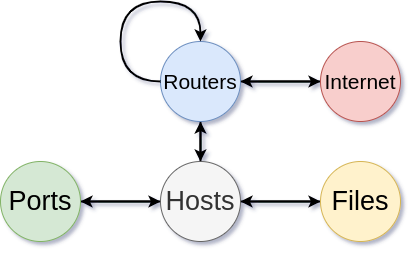
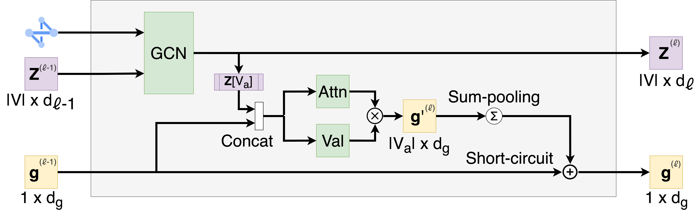

# KEEP: A GNN-based PPO Model for MARL

This repository contains the code we submitted to the [TTCP CAGE Challenge-4](https://github.com/cage-challenge/cage-challenge-4) autonomous cyber defense MARL contest. Our agent placed 5th on the final leader board with a score of -193.68. Here we will document how to run our code, and describe our approach.

## Running the code

We have included a `requirements.txt` file that lists all of the modules necessary to run the code. In addition to this file, it is assumed that `CybORG` for CAGE-4 is in the python path, and its required modules are also in your python environment. This can be accomplished by cloning [their repository](https://github.com/cage-challenge/cage-challenge-4), installing their required packages, and running `echo "path/to/cage-challenge-4/CybORG" > path/to/venv/lib/python3.11/site-packages/CybORG.pth` or using `conda develop path/to/cage-challenge-4/CybORG`.

To run the evaluation script, simply execute `python evaluation.py`. There are two optional flags: to speed up execution, use `--distribute N` where `N` is the number of worker processes to run in parallel (default 1); to configure the number of episodes to simulate, use `--max-eps E` where `E` is the desired number of episodes (default 100).

To train a new agent, use the command `python train.py [OUTPUT_FILE_NAME]`. You may also use the optional flags `--hidden` and `--embedding` to configure the number of parameters used by the models hidden and embedding layers respectively (default 256, 128). This will create two new directories: `logs` and `checkpoints` where logs and model weights will be saved respectively.

## Environment Representation

### Graph Schema

 
<h4 align="center">Figure 1: Graph schema diagram</h4>

The observation graph parses the dictionaries provided by CybORG into a graph. We track 5 kinds of entities: Hosts (users and servers), Routers, Open Ports, Files, and the internet. Figure 1 shows how these entities interrelate. Hosts communicate with ports, own files, and are members of a subnet managed by a router. Routers communicate with other routers, and communicate with the internet.

Taking actions in the environment may cause new edges or nodes to be added to the graph. Below is a table of the actions and observations that may cause this to occur.

<h4 align="center">Table 1: Graph edits resulting from actions</h4>

| **Event**         | **Effect**                |   **Graph edit**                                                                                                                         |
|-------------------|---------------------------------------------------------------------------------------------|-------------------------------------------------------------------|
| `Restore`         | Remove all edges to/from files and (non-default) connections into the restored node.        |     Node-level                                                    |
| `DeployDecoy`     | Create a new connection node and add an edge to/from the host that deployed it.             |     Node-level                                                    |
| `Analyze`         | Add a file node, and an edge to the host analyzed if one was found.                         |     Node-level                                                    |
| `AllowConnection` | Create an edge between the two subnets.                                                     |     Edge-level                                                    |
| `BlockConnection` | Delete the edge between the two subnets.                                                    |     Edge-level                                                    |
| `Monitor`         | Add any new connection nodes (processes with port information) observed, and create edges between them and the hosts they occur on, as well as the source host. |   Global-level |

### Node Features

The table below lists all features tracked by the observation graph, and the `GraphWrapper` class.

<h4 align="center">Table 2: Features tracked in the observation graph</h4>

| **Node Type** | **Feature**         | **Description**                                                                                                                      |
|---------------|---------------------|--------------------------------------------------------------------------------------------------------------------------------------|
|   **Hosts/Routers**   | CybORG Enums        | One-hot vectors for OS Version, distro, arch, etc. provided in observation dictionaries                                              |
|               | `isUser`            | If this node is a PC                                                                                                                 |
|               | `isServer`          | If this node is a server                                                                                                             |
|               | `isRouter`          | If this node is a router                                                                                                             |
|   **Ports**   | CybORG Enums        | Port number, process name, process type, etc. provided in observation dictionaries                                                   |
|               | `isEphemeral`       | If this port is ephemeral (gt;49152)                                                                                                 |
|               | `isDefault`         | If this port was seen in the initial observation, and is a service that runs on this machine normally                                |
|               | `isDecoy`           | If this port is a decoy process                                                                                                      |
|   **Files**   | CybORG Enums        | Version, type, vendor, etc. provided in observation dictionaries                                                                     |
|               | Density             | When a file is `Analyze`d, a density value is provided                                                                               |
|               | Signed              | When a file is `Analyze`d, a boolean for if it was signed is provided                                                                |
| **Internet**  | None                | This is a purely structural node type to connect subnets together if they have internet connection                                   |
|    **All**    | Subnet Membership   | One-hot vector denoting which subnet a node belongs to                                                                               |
|               | Node type           | One-hot vector denoting node type (Host, Port, File, or Internet)                                                                    |
|               | Tabular Observation | The observation provided by the `EnterpriseMAE` wrapper is parsed, and the information is concatenated with the relevant host nodes  |
|               | Messages | Any messages recieved from the other agents. Message features are concatenated to the features of the subnets monitored by the agent that sent them. |

Agents also attempt to send each other messages, if the communication policy for the particular phase allows. These messages are only allowed to consist of 8 bits of information. We use these messages to share the information from the `EnterpriseMAE` wrapper that agents recieved about the machines they monitor. For each subnet an agent monitors, it adds 2 bits of information to represent if *any* host on that subnet is comprimised, or has been scanned. We add an additional bit at the end of the message to act as a checkbit, such that if an agent sends 0's, they mean "no comprimise" if the checkbit is present, and, "agent cannot communicate" if it is not.

## Agent Architecture

Both the actor and the critic models use modified graph convolutional networks (GCNs) [(Kipf & Welling, 2017)](https://arxiv.org/abs/1609.02907) to process the graph states. Additionally, they use a simple self-attention model to combine node features with a global state vector `g`. Both the actor and critic use two of these layers followed by a 2-layer feed-forward neural net to project node embeddings in to action probabilities. This module is illustrated in Figure 2.

 
<h3 align="center">Figure 2: Agent architecture diagram</h3>

Importantly, our models do not simply output a one-dimensional vector of all action probabilities. Instead, we frame actions as functions upon nodes, edges or the complete environment. Some subset of nodes, `V_a` are "actionable". That is, we can perform actions upon them. In this scenario, these are host nodes, which can be restored, analyzed, or decoyed, and pairs of router nodes (and the internet node), which can be allowed or blocked from communicating. Thus, the actor model outputs a `V_a x |a_n|` dimensional matrix, (here, `|a_n|`=3) of possible node-level actions, a `|E_a| x |a_e|` dimensional matrix of edge-level actions (here `|a_e|`=2), and a `1 x |a_g|` dimensional matrix of global actions (here `|a_g|`=1). The "graph edit" column of Table 1 shows which actions affect which levels.

The critic network, because it is estimating the value of states as a whole only uses the final `g` vector to make its state-value estimates. It passes the final `g` vector through a 2-layer feed-forward neural net to produce a 1-dimensional value estimate.